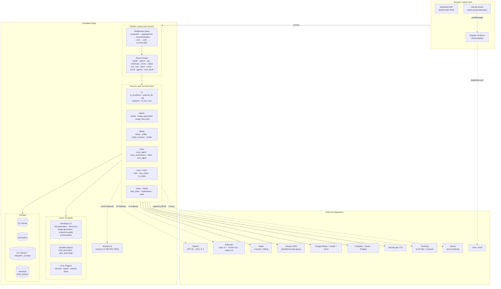

# Project Sites — Architecture Document

> Detailed technical architecture for the Project Sites SaaS website delivery engine.
> **Scope:** the SHIPPED single-worker system + the as-deployed map and Fly/Cloudflare split.
> This is the single canonical architecture doc. Future-topology decisions (per-tenant D1,
> worker split) are logged as ADRs in [`../DECISIONS.md`](../DECISIONS.md).

## System Overview (Mermaid)



### Legacy ASCII overview (kept for terminals without Mermaid)

```
┌─────────────────────────────────────────────────────────────────┐
│                     Cloudflare Edge Network                       │
│                                                                   │
│  ┌─────────────────┐    ┌──────────────────────────────────────┐│
│  │  Pages (bolt.diy) │    │  Worker (project-sites)              ││
│  │  bolt.megabyte.   │    │  sites.megabyte.space                ││
│  │  space            │    │  *-sites.megabyte.space              ││
│  │                   │    │                                      ││
│  │  Remix + Vite     │    │  Hono Framework                     ││
│  │  AI Code Editor   │    │  ├── Middleware Stack                ││
│  │                   │    │  ├── API Routes                     ││
│  │                   │    │  ├── Site Serving                   ││
│  │                   │    │  └── Queue Consumer                 ││
│  └─────────────────┘    └──────────┬───────────────────────────┘│
│                                     │                             │
│  ┌──────────┐  ┌─────┐  ┌────────┐ │ ┌──────────┐  ┌──────────┐│
│  │    D1    │  │ KV  │  │   R2   │ │ │Workflows │  │Workers AI││
│  │ (SQLite) │  │Cache│  │Storage │ │ │ (Durable)│  │  (LLM)   ││
│  └──────────┘  └─────┘  └────────┘ │ └──────────┘  └──────────┘│
└─────────────────────────────────────┼───────────────────────────┘
                                      │
         ┌────────────────────────────┼──────────────────────┐
         │                            │                      │
    ┌────┴────┐  ┌─────────┐  ┌──────┴───┐  ┌───────────┐  │
    │ Stripe  │  │ SES     │  │Google    │  │ PostHog   │  │
    │Payments │  │ Email   │  │OAuth+API │  │ Analytics │  │
    └─────────┘  └─────────┘  └──────────┘  └───────────┘  │
                                                            │
                                                    ┌───────┴──┐
                                                    │  Sentry  │
                                                    │  Errors  │
                                                    └──────────┘
```

### Related references

- [AI_INTEGRATION.md](./AI_INTEGRATION.md) — AI Gateway, Vectorize, PostHog LLM-obs, Media, Env Vars, Task Tray
- [DEPLOYMENT.md](./DEPLOYMENT.md) — auth chain, wrangler commands, pre-flight bindings, smoke tests
- `apps/project-sites/CLAUDE.md` — worker source layout + API surface
- `apps/project-sites/frontend/CLAUDE.md` — frontend source layout + components

## Request Flow

### 1. Incoming Request Classification

```
Request → Worker
  │
  ├─ hostname = sites.megabyte.space OR sites-staging.megabyte.space
  │   └─ Marketing site (serve from R2: marketing/*)
  │
  ├─ path starts with /health
  │   └─ Health check (probe KV + R2)
  │
  ├─ path starts with /api/search/* OR /api/sites/lookup OR /api/sites/search
  │   └─ Search routes (public, no auth required)
  │
  ├─ path starts with /api/*
  │   └─ API routes (auth middleware extracts session)
  │
  ├─ path starts with /webhooks/*
  │   └─ Webhook routes (signature verification)
  │
  └─ hostname = {slug}-sites.megabyte.space
      └─ Site serving (resolve slug → D1 → R2)
```

### 2. Middleware Stack (every request)

```
Request
  │
  ├─ 1. requestIdMiddleware
  │     Generate crypto.randomUUID() or use X-Request-ID header
  │     Set on Hono context: c.set('requestId', id)
  │
  ├─ 2. payloadLimitMiddleware
  │     Check Content-Length vs DEFAULT_CAPS.MAX_REQUEST_BODY_BYTES (256KB)
  │     Throw AppError(413) if exceeded
  │
  ├─ 3. securityHeadersMiddleware
  │     Set: HSTS, X-Frame-Options, X-Content-Type-Options,
  │           Referrer-Policy, Permissions-Policy, CSP
  │
  ├─ 4. cors (API routes only)
  │     Allow: sites domains, bolt domains, localhost:3000/5173
  │     Methods: GET, POST, PATCH, DELETE, OPTIONS
  │     Credentials: true
  │
  ├─ 5. authMiddleware (API routes only)
  │     Extract Bearer token → SHA-256 hash → D1 sessions lookup
  │     Set: userId, orgId, userRole, billingAdmin (or leave unset)
  │
  └─ 6. errorHandler (onError)
        AppError → JSON { error: { code, message, request_id } }
        ZodError → 400 { error: { code: 'VALIDATION_ERROR', details: issues } }
        Unknown → 500, report to Sentry + PostHog
```

## Data Architecture

### D1 Schema (16 tables)

```
orgs ─────────┐
              ├── memberships ──── users
              ├── sites ──────┬── hostnames
              │               ├── confidence_attributes
              │               ├── research_data
              │               └── analytics_daily
              ├── subscriptions
              ├── audit_logs
              ├── workflow_jobs
              ├── webhook_events
              ├── funnel_events
              └── usage_events

users ────┬── sessions
          ├── magic_links (by email)
          └── phone_otps (by phone)

oauth_states (standalone, ephemeral)
feature_flags (standalone, org-scoped)
admin_settings (standalone, global)
lighthouse_runs (site-scoped)
```

### Multi-Tenancy Pattern

Every data table is scoped to `org_id`:
1. Auth middleware extracts `userId` from session
2. Membership lookup: `SELECT org_id FROM memberships WHERE user_id = ?`
3. All queries filter by `org_id` (enforced in route handlers)
4. Reference schema has RLS policies for Postgres (D1 doesn't support RLS natively)

### Soft Delete Pattern

Every table has `deleted_at TIMESTAMPTZ`:
- Active records: `WHERE deleted_at IS NULL`
- "Delete" = `UPDATE SET deleted_at = now()`
- Queries always filter `deleted_at IS NULL`
- Indexes use `WHERE deleted_at IS NULL` partial indexes

### D1 vs Postgres Differences

| Postgres | D1 (SQLite) |
|----------|-------------|
| `UUID` type | `TEXT` (store UUID strings) |
| `TIMESTAMPTZ` | `TEXT` (store ISO-8601 strings) |
| `BOOLEAN` | `INTEGER` (0/1) |
| `JSONB` | `TEXT` (store JSON strings) |
| `gen_random_uuid()` | `crypto.randomUUID()` in JS |
| `now()` | `new Date().toISOString()` in JS |
| `$1, $2` params | `?` placeholders |
| RLS policies | Enforced in application code |

## AI Workflow Architecture

### Cloudflare Workflow (site-generation.ts)

The AI site generation uses Cloudflare Workflows for durability and automatic retries:

```
┌────────────────────────────────────────────────────────────────┐
│                   SiteGenerationWorkflow                        │
│                                                                 │
│  Step 1: research-profile (sequential)                         │
│    → Extracts business_type needed for all subsequent steps     │
│    → Retry: 3x, 10s backoff, 2min timeout                     │
│                                                                 │
│  Step 2: Parallel research                                      │
│    ├── research-social      → social links + website URL        │
│    ├── research-brand       → logo, colors, fonts              │
│    ├── research-selling-points → 3 USPs + hero slogans         │
│    └── research-images      → image strategies                  │
│    → All: Retry 3x, 10s backoff, 2min timeout                 │
│                                                                 │
│  Step 3: generate-website (sequential)                          │
│    → Full HTML from all research data                           │
│    → Retry: 3x, 15s backoff, 5min timeout                     │
│                                                                 │
│  Step 4: Parallel finalization                                  │
│    ├── generate-privacy-page  → privacy policy HTML             │
│    ├── generate-terms-page    → terms of service HTML           │
│    └── score-website          → 8-dimension quality score       │
│    → Legal: Retry 3x, 10s backoff, 3min timeout               │
│    → Scoring: Retry 2x, 10s backoff, 2min timeout             │
│                                                                 │
│  Step 5: upload-to-r2                                          │
│    → sites/{slug}/{version}/index.html                         │
│    → sites/{slug}/{version}/privacy.html                       │
│    → sites/{slug}/{version}/terms.html                         │
│    → sites/{slug}/{version}/research.json                      │
│    → Retry: 3x, 5s backoff, 1min timeout                      │
│                                                                 │
│  Step 6: update-site-status                                    │
│    → D1: SET status='published', current_build_version=ver     │
│    → Retry: 3x, 5s backoff, 30s timeout                       │
└────────────────────────────────────────────────────────────────┘
```

### LLM Call Pattern

Every AI call follows this pattern:
1. Resolve prompt from registry (`resolve(id, version)`)
2. Validate inputs against Zod schema (`validatePromptInput`)
3. Render prompt templates (`renderPrompt`)
4. Call Workers AI via `env.AI.run(model, messages)`
5. Parse output (JSON or HTML)
6. Validate output against Zod schema (`validatePromptOutput`)
7. Log call metrics via observability wrapper

### Injection Prevention

User-provided inputs in prompts are wrapped in delimiters:
```
<<<USER_INPUT>>>
Vito's Mens Salon, Lake Hiawatha NJ
<<<END_USER_INPUT>>>
```

This prevents prompt injection by clearly delineating untrusted content.

## Caching Architecture

### KV Cache (60s TTL)

```
Key: host:{hostname}
Value: JSON { siteId, slug, version, orgId, isPaid }
TTL: 60 seconds

Purpose: Avoid D1 query on every page view for customer sites
Write: On cache miss during site serving
Invalidate: TTL-based (no explicit invalidation)
```

### Prompt KV Store (no TTL)

```
Key: prompt:{id}@{version}
Value: Raw .prompt.md content (YAML + markdown)

Purpose: Runtime hot-patching of prompts without deploy
Read: On worker startup via loadFromKv()
Write: Manual via wrangler kv:put
```

## Site Serving Architecture

### R2 Bucket Layout

```
project-sites-{env}/
├── marketing/
│   ├── index.html          # Homepage SPA
│   ├── privacy.html        # Privacy policy
│   ├── terms.html          # Terms of service
│   ├── favicon.ico
│   ├── site.webmanifest
│   └── *.svg/*.png         # Static assets
└── sites/
    └── {slug}/
        └── {version}/
            ├── index.html      # Generated site
            ├── privacy.html    # Generated privacy page
            ├── terms.html      # Generated terms page
            └── research.json   # AI research data
```

### Serving Decision Tree

```
hostname == base_domain?
  ├─ YES: path == '/' ? marketing/index.html : marketing/{path}
  │        ├─ Found: Serve (inject PostHog key for HTML)
  │        ├─ Not found + no extension: Try marketing/{path}.html
  │        └─ Still not found: Return JSON info
  └─ NO (subdomain):
       ├─ Resolve site (KV cache → D1 hostnames → D1 sites → D1 subscriptions)
       ├─ Not found → 404 JSON
       ├─ Found: Serve from R2 sites/{slug}/{version}/{path}
       └─ Unpaid: Inject top bar after <body> tag
```

### Top Bar Injection (unpaid sites)

For sites on the free plan, a branding top bar is injected:
```html
<div style="background:#7c3aed;color:white;text-align:center;padding:8px;font-family:Inter,sans-serif;font-size:14px;">
  Powered by <a href="https://sites.megabyte.space" style="color:white;text-decoration:underline;">Project Sites</a>
  — <a href="https://sites.megabyte.space" style="color:white;text-decoration:underline;">Remove this bar</a>
</div>
```

## Authentication Architecture

### Session Flow

```
Sign In → findOrCreateUser() → createSession()
  │
  ├─ Hash plaintext token with SHA-256
  ├─ Store hash in sessions table (never store plaintext)
  ├─ Return plaintext token to client
  └─ Client sends: Authorization: Bearer {plaintext_token}

Subsequent requests:
  │
  ├─ Auth middleware extracts Bearer token
  ├─ SHA-256 hash the token
  ├─ Look up hash in sessions table
  ├─ Check expiry (30 days)
  ├─ Bump last_active_at
  └─ Set userId, orgId on Hono context
```

### User Provisioning (findOrCreateUser)

```
1. Look up user by email or phone
2. If not found:
   a. Create user record
   b. Create org record (name = display_name or email prefix)
   c. Create membership (role = 'owner')
3. If found: return existing user
4. Lookup membership to get org_id
5. Return { userId, orgId }
```

## Billing Architecture

### Stripe Integration Pattern

```
Customer Journey:
  Free Site → Click Upgrade → Stripe Checkout → Webhook → Paid

Checkout:
  1. getOrCreateStripeCustomer(orgId, email)
  2. stripe.checkout.sessions.create({ mode: 'subscription', ... })
  3. Return checkout_url to frontend
  4. User completes payment in Stripe-hosted page

Webhook Processing:
  1. Verify signature (HMAC-SHA256, timing-safe compare)
  2. Check idempotency (webhook_events table)
  3. Store event (status: 'processing')
  4. Dispatch to handler by event.type
  5. Update subscription record
  6. Write audit log
  7. Mark event processed
```

### Entitlement Derivation

```
subscription.plan == 'paid' && subscription.status == 'active'
  → topBarHidden: true
  → maxCustomDomains: 5
  → analyticsEnabled: true

subscription.plan == 'free' OR status != 'active'
  → topBarHidden: false
  → maxCustomDomains: 0
  → analyticsEnabled: false
```

## Error Handling Architecture

### Error Type Hierarchy

```
AppError (extends Error)
  ├── code: ApiErrorCode       # Machine-readable code
  ├── statusCode: number       # HTTP status
  ├── message: string          # Human-readable message
  ├── details?: object         # Validation details, extra context
  ├── requestId?: string       # Correlation ID
  └── toJSON()                 # Standard error envelope

Error Flow:
  Route Handler → throw AppError → errorHandler middleware → JSON response
  Route Handler → throw ZodError → errorHandler middleware → 400 + issues
  Route Handler → throw unknown  → errorHandler → 500 + Sentry report
```

### Error Response Contract

```json
{
  "error": {
    "code": "VALIDATION_ERROR",
    "message": "Invalid request body",
    "request_id": "550e8400-e29b-41d4-a716-446655440000",
    "details": {
      "issues": [
        { "path": ["email"], "message": "Invalid email format" }
      ]
    }
  }
}
```


---

<!-- folded from architecture/current.md (2026-06-27) -->

# Current Architecture (2026)

This document describes the projectsites.dev platform architecture as deployed. It is the authoritative reference for service boundaries, hosts, and responsibilities.

---

## Components

| Component | Technology | Host | URL | Purpose |
|---|---|---|---|---|
| Main Worker | Hono + TypeScript | CF Workers | projectsites.dev | API gateway, site serving, business logic, auth |
| Frontend Admin | Angular 21 + Nx | CF Pages | projectsites.dev/admin | Tenant administration UI |
| bolt.diy Editor | Remix + Vite | CF Pages | editor.projectsites.dev | AI-powered web IDE (embed only) |
| ClickHouse | ClickHouse 24.x | Fly.io (iad) | Internal HTTP only | High-volume analytics warehouse |
| Chatwoot | Rails + Sidekiq | Fly.io (iad) | support.projectsites.dev | Customer support |
| Postiz | Next.js (AGPL) | CF Container | social.projectsites.dev | Social scheduling (transition service) |
| Inngest | Inngest CE | CF Container | events.projectsites.dev | Background event bus |
| LiteLLM | Python | CF Container | llm.megabyte.space | LLM proxy / routing |
| Twenty CRM | Node.js | CF Container | crm.projectsites.dev | Internal CRM |
| Payload CMS | Node.js | CF Container | cms.projectsites.dev | Content management |
| Listmonk | Go | CF Container | mail.projectsites.dev | Mailing list / transactional email |

---

## Data Layer

| Store | Technology | Host | Used For |
|---|---|---|---|
| Primary DB | Cloudflare D1 (SQLite) | CF D1 | Sites, users, orgs, billing, feature flags, domains |
| Analytics Cache | Cloudflare KV | CF KV | Host resolution (60s TTL), prompt cache, flag snapshots |
| File Storage | Cloudflare R2 | CF R2 | Generated sites, marketing homepage, social media |
| Analytics Warehouse | ClickHouse 24.x | Fly.io | page_views, events, site_builds |
| Postgres (services) | Neon (shared project) | Neon Cloud | Chatwoot, Twenty CRM, other service DBs |
| Redis (services) | Upstash Redis | Upstash Cloud | Chatwoot action cable, Sidekiq, service caches |
| AI Inference | CF Workers AI | CF Workers AI | Llama 3.1 for site generation |

---

## Key Design Decisions

- **No Supabase** — D1 via parameterized SQL handles all relational needs for Workers; Supabase JS SDK is incompatible with the Workers runtime.
- **R2 paths are version-keyed** — `sites/{slug}/{version}/{file}` enables instant rollback without redeployment.
- **Dot subdomains for sites** — `{slug}.projectsites.dev` serves generated sites; the routing Worker reads the subdomain from the `Host` header.
- **No global interceptor for Angular HTTP** — use `ApiService` (not raw `HttpClient`) for all authenticated calls; raw `HttpClient` sends no bearer token.
- **Persistent bolt.diy iframe** — `BoltEmbedService` owns the iframe lifecycle across admin sub-routes; the iframe lives in `AdminComponent`, not in the editor route, so WebContainer cold-boot (~30-60s) happens once per session.
- **CF Access on all internal services** — Chatwoot, LiteLLM, Twenty CRM, Payload CMS, Listmonk, events.projectsites.dev are behind CF Access using the `projectsites-infra` service token.
- **Sentry fully removed** — replaced by PostHog (errors + analytics + session recording) + Axiom (structured logs) + OTel (trace correlation).
- **One dialog primitive** — all admin modals render via `DialogShellComponent`; custom modals are not permitted.
- **Design tokens in `_polish.scss`** — `--ps-bg`, `--ps-ink`, `--ps-accent`, `--ps-z-overlay-takeover`, `--ps-radius-xl`, `--ps-shadow-modal`. Hard-coded brand colors fail audits.
- **Postiz is AGPL-isolated** — communication via HTTP API only; no Postiz code imported anywhere.

---

## Service Communication

```
Browser
  |
  +--[HTTPS]--> CF Edge
  |               |
  |               +--[Workers]---> Main Worker (Hono)
  |               |                 |
  |               |                 +--[D1 SQL]-----> Cloudflare D1
  |               |                 +--[KV get/put]--> Cloudflare KV
  |               |                 +--[R2 get/put]--> Cloudflare R2
  |               |                 +--[Queue send]--> CF Queue --> Analytics Consumer
  |               |                 +--[Workflow]----> Site Generation Workflow
  |               |                 +--[Workers AI]--> Llama 3.1
  |               |                 +--[HTTP]--------> Chatwoot (Fly) [CF Access]
  |               |                 +--[HTTP]--------> Postiz (CF Container)
  |               |                 +--[HTTP]--------> ClickHouse (Fly) [internal]
  |               |                 +--[HTTP]--------> SES (email)
  |               |                 +--[HTTP]--------> Stripe (billing)
  |               |
  |               +--[Pages]-----> Angular Admin SPA (CF Pages)
  |               +--[Pages]-----> bolt.diy Editor (CF Pages) [embed-only]
  |
  +--[HTTPS]--> support.projectsites.dev --> Chatwoot (Fly) [CF Access]
  +--[HTTPS]--> social.projectsites.dev  --> Postiz (CF Container)
  +--[HTTPS]--> events.projectsites.dev  --> Inngest (CF Container) [CF Access]
```

---

## Security Perimeter

| Layer | Technology | Scope |
|---|---|---|
| DDoS + WAF | Cloudflare WAF | All traffic to `*.projectsites.dev` |
| Bot mitigation | Cloudflare Turnstile | Public forms, checkout |
| Internal service auth | Cloudflare Access (CF Access) | Chatwoot, LiteLLM, Twenty CRM, Payload CMS, Inngest, Listmonk |
| Service-to-service | CF Access service token (`projectsites-infra`) | Worker → internal services |
| API auth | HMAC-signed JWT (Clerk M2M for admin) | `/api/*` routes |
| WAF MCP skip rule | CF WAF custom rule | `/api/mcp/*` and `/oauth/*` skip origin challenge |

---

## Vendor Inventory

Every third-party service is tiered per the global `vendor-risk-tiering` rule. **Load-bearing** = replacing it costs multi-week data/auth migration (documented replacement plan + secret rotation required). **Replaceable** = swap in days; no abstraction layer required.

| Vendor | Purpose | Tier | Replacement plan (load-bearing) / swap time (replaceable) |
|---|---|---|---|
| Cloudflare (Workers, D1, R2, KV, DO, Queues, Workflows, Access, Turnstile, Pages, AI) | Entire runtime + deploy target | Load-bearing | **No plan by design** — deep CF lock-in is the declared strategy (`cloudflare-lock-in-is-leverage`). Migration would mean porting every binding + D1 schema + R2 objects off-platform: 3-6 months. |
| Clerk | Admin M2M JWT for `/api/*` | Load-bearing | Replace with Better Auth (already in `package.json`) as the user-facing auth rail; admin M2M moves to HMAC-signed JWTs issued by the Worker. ~2 weeks (JWT format + session migration). |
| Stripe | Subscriptions, checkout, Connect Express payouts | Load-bearing | Re-route to Square for accept-money + issue manual payouts; requires subscription data migration + webhook re-wiring + stored-price remap. ~3-4 weeks. Never mix rails for the same payment type (`payments-routing`). |
| Square | POS / in-person accept-money | Load-bearing | Fall back to Stripe Checkout for all accept-money; POS-only surfaces lose tap-to-pay. ~2 weeks. |
| Amazon SES | Sole transactional email rail | Load-bearing | SendGrid is the **only break-glass fallback** (`SENDGRID_API_KEY`); a full swap means re-verifying domain identity (DKIM/SPF/DMARC) + re-warming the sending IP + re-checking suppression lists. ~1-2 weeks. (`getEmailProvider`/`sendEmail` is the abstraction seam.) |
| PostHog | Product analytics + LLM observability | Replaceable | Swap to Plausible / Amplitude in **1-2 days** — events fire through `src/services/analytics_*.ts`. |
| Sentry | Error tracking (HTTP API, `SENTRY_DSN`) | Replaceable | Swap to Axiom / BugSnag in **1 day** — single `onError` seam. |
| Upstash | Redis provisioning for container services | Replaceable | Swap to CF KV directly in **1-2 days** — only used by Fly.io-hosted services, not the main Worker. |

> **Removed — never reintroduce:** Resend was retired 2026-09-09 (Brian directive); Amazon SES is the sole email rail with SendGrid as break-glass only. Residual `resend` strings in `newsletter_dispatch.ts` / `event_transform.ts` are MCP-integration provider keys (a separate customer feature), not a send rail.

### Secret rotation

All load-bearing vendor secrets rotate on a **≤90-day cadence**. One calendar entry per load-bearing vendor lives in `~/.claude/rules/secret-rotation-calendar.md`; the project-level rotation runbook is `docs/runbooks/` (per `secret-provisioning`).

---

## Related Docs

- [CF vs Fly split decision](./ARCHITECTURE.md)
- [Observability stack](./OBSERVABILITY.md)
- [ClickHouse warehouse](./OBSERVABILITY.md)
- [Chatwoot service](./SERVICES-AND-SOCIAL.md)
- [Postiz service](./SERVICES-AND-SOCIAL.md)
- [Native social architecture](./SERVICES-AND-SOCIAL.md)


---

<!-- folded from architecture/fly-cloudflare-split.md (2026-06-27) -->

# Architecture Decision: Cloudflare vs Fly.io Split

## Rule

The default hosting choice for every service in projectsites.dev is **Cloudflare Containers + Neon + Upstash**. Fly.io is used only when Cloudflare genuinely cannot meet a service's requirements.

This document records the current split, the rationale for each Fly.io deployment, and the migration path back to CF if/when CF closes the gap.

---

## Decision Table

| Service | Host | Rationale for Fly.io | CF Alternative (if it existed) |
|---|---|---|---|
| ClickHouse | Fly.io | Needs persistent block storage significantly larger than CF Container ephemeral disk; persistent volumes on CF Containers are limited; ClickHouse requires fast local NVMe for MergeTree operations | CF Containers with large persistent volumes — revisit when CF adds 50GB+ persistent block storage |
| Chatwoot | Fly.io | Requires multi-process supervision: Rails, Sidekiq workers, and background job processing run as separate OS processes. CF Containers is a single-process runtime per container instance. | CF Containers with multi-process support, OR a purpose-built Worker-native support inbox (psnotify + inbox) that replaces Chatwoot long-term |

All other services (Inngest, LiteLLM, Twenty CRM, Payload CMS, Listmonk, Postiz) run on CF Containers.

---

## Operational Differences

| Characteristic | CF Containers | Fly.io |
|---|---|---|
| Startup model | On-demand (cold start on first request) | Always-on (min_machines_running = 1) |
| Billing | Per-request when scaled to zero; per-second when active | Always-on VM cost (~$5-50/mo per VM depending on size) |
| Persistent storage | Ephemeral disk per container restart (limited volumes in preview) | Persistent volumes up to TB range; survives restarts/redeploys |
| Multi-process | Single entrypoint process per container | Full VM — supervisor (Overmind, Foreman, s6) can run multiple processes |
| Integration with Workers | Native — Workers can invoke CF Containers via DO bindings | External HTTP — Workers call Fly apps via HTTPS |
| Networking | CF global edge — zero-latency from Workers | Fly anycast — ~20-50ms from CF Workers to Fly iad region |
| Scale to zero | Yes (configurable) | Optional (`auto_stop_machines = true`; analytics warehouse keeps `false`) |
| CF Access | Native (same account, zero config) | Requires CF Tunnel or public domain + Access policy |
| Deploy tooling | `wrangler deploy` | `fly deploy` |
| Secrets management | `wrangler secret put` → CF secrets | `fly secrets set` → Fly secrets |

---

## Why Not More Fly.io

Fly.io VMs have persistent processes, native volumes, and multi-process support — genuinely better for some workloads. However:

1. **Deep CF lock-in is the feature, not the risk.** Every primitive on CF (D1, KV, R2, Queues, Durable Objects, Workflows, Access) reduces integration surface, eliminates egress costs between services, and simplifies the operational model. Adding Fly.io breaks this cohesion.
2. **CF Workers and CF Containers share a deployment pipeline.** `wrangler deploy` deploys both; no separate CI job, no separate secrets store. Adding Fly.io requires a parallel `fly deploy` step and a separate `fly secrets` store.
3. **Egress costs.** Data transferred from a Fly.io VM to a CF Worker incurs egress fees on Fly's side. CF Container → CF Worker is intra-platform, zero egress.
4. **CF is improving.** Persistent volumes, larger container sizes, and multi-process support are on CF's roadmap. Every Fly.io deployment is a candidate for future migration back.

---

## Migration Path: Fly.io → CF

### ClickHouse

**Trigger:** CF Containers adds persistent volumes >= 50GB with fast local NVMe, or CF announces a managed ClickHouse-compatible product.

**Migration steps:**
1. Provision CF Container with persistent volume.
2. Run `clickhouse-backup` to export from Fly ClickHouse to R2.
3. Restore to new CF Container ClickHouse.
4. Update `CLICKHOUSE_HOST` Worker secret to point to CF Container.
5. Verify event counts and query performance.
6. Decommission Fly ClickHouse VM and volume.

**Alternative:** If volume requirements stay moderate (<50M events/day), migrate to Tinybird managed service instead. See [ClickHouse Tinybird promotion path](./OBSERVABILITY.md).

### Chatwoot

**Trigger:** CF Containers adds multi-process support, OR psnotify (the ProjectSites-native support inbox) matures to replace Chatwoot's core feature set.

**Migration steps (psnotify path):**
1. psnotify implements: inbox, conversations, agent assignment, email routing, webhook.
2. Migrate open Chatwoot conversations to psnotify (export via Chatwoot API).
3. Update DNS: `support.projectsites.dev` CNAME to `projectsites.dev`.
4. Decommission Fly Chatwoot app and Neon database.

---

## Neon and Upstash Note

Neon (Postgres) and Upstash (Redis) are used by Fly.io services because those services require their respective databases. They are not used by the main Worker (which uses D1 for relational data). This is consistent with the CF-first rule: D1 is the default; Neon is the fallback only when Postgres semantics are genuinely required.

When Fly.io services are decommissioned, their Neon databases are dropped (not the Neon project).

---

## Related Docs

- [ClickHouse warehouse](./OBSERVABILITY.md)
- [Chatwoot service](./SERVICES-AND-SOCIAL.md)
- [Deployment: Fly.io guide](./DEPLOYMENT.md)
